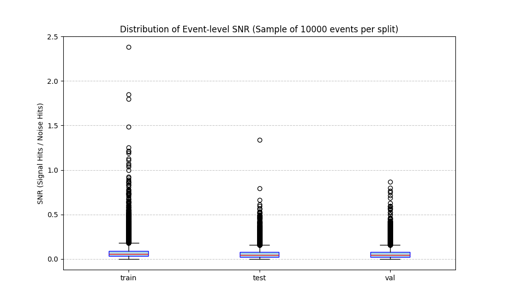

# SNR Calculation for Baikal MC2020 Dataset

## Goal
Calculate the Signal-to-Noise Ratio (SNR) in the `labels/data` datasets for `train`, `test`, and `val` splits.

## Method
SNR is defined as the ratio of signal hits (label != 0) to noise hits (label == 0).
- **Signal**: Hits with label != 0 (Monte Carlo truth signal, including negative IDs).
- **Noise**: Hits with label == 0 (Radioactive background).

The calculation was performed in chunks to handle the dataset's scale (~1.4B hits).

## Results

| Dataset | Signal hits (label != 0) | Noise hits (label == 0) | SNR (Signal/Noise) | Signal % |
| :--- | ---: | ---: | :--- | :--- |
| **train** | 103,372,582 | 1,327,947,135 | **0.077844** | 7.2222% |
| **test** | 6,783,728 | 78,711,731 | **0.086184** | 7.9346% |
| **val** | 1,860,072 | 22,596,566 | **0.082317** | 7.6056% |

## Data Source
File: `/home3/ivkhar/Baikal/data/normed/baikal_mc2020_multi_split_0924mid_eq_norm.h5`

## Visualizations
The following boxplot shows the distribution of SNR calculated on a per-event basis for a sample of 10,000 events from each split.

## Scripts
- `src/calculate_snr.py`: Global SNR calculation.
- `src/plot_snr_dist.py`: Event-level SNR distribution and plotting.
