# Экспериментальный Дневник (Walkthrough)

## 2026-03-07 11:35
### Исследование результатов эксперимента от 28 февраля

**Цель**: Понять причины низких показателей модели GCN и проверить гипотезу о влиянии `LayerNorm` на результаты.

**Выполненные шаги**:
1.  **Анализ структуры графов**: 
    Созданы тепловые карты матриц смежности для различных значений временного окна $k$ (2, 3, 4, 12). Визуальный анализ подтверждает, что при $k=12$ (иногда экспериментально использовавшемся ранее) матрицы слишком плотные, что может приводить к избыточному сглаживанию признаков. При $k=2, 3, 4$ структура более разреженная и потенциально более информативная.

    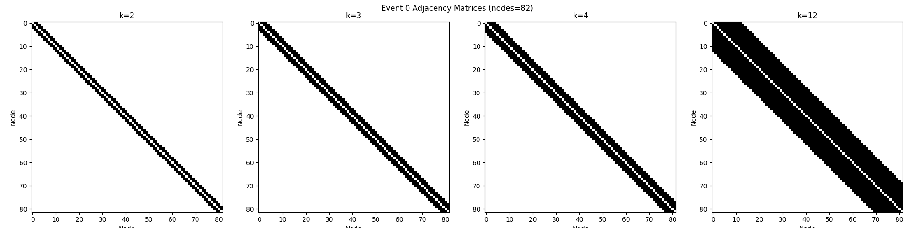

2.  **Модификация архитектуры**:
    Из модели `GCN` удалены слои `LayerNorm` (после первой и второй сверток). Гипотеза: `LayerNorm` может негативно влиять на обучение в данной специфической задаче из-за разреженности данных или особенностей признаков.

3.  **Результаты обучения (15 эпох)**:
    Обучение на 50 000 событиях при $k=12$ без `LayerNorm` показало значительное улучшение метрики `Recall`.

**Финальные результаты**:
| Эпоха | Val Loss | Val Precision | Val Recall |
| :--- | :--- | :--- | :--- |
| 1 | 0.2314 | 0.4889 | 0.0985 |
| 5 | 0.1980 | 0.4085 | 0.3850 |
| 10 | 0.1905 | 0.4233 | 0.4170 |
| 15 | 0.1884 | 0.4262 | 0.4410 |

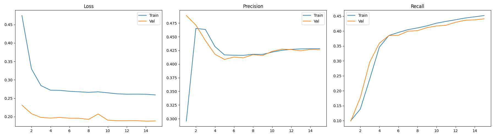

**Выводы**:
- Удаление `LayerNorm` позволило модели начать обучаться (стабильный рост `Recall`).
- Метрики всё еще требуют улучшения, но прогресс по сравнению с экспериментом от 28.02 очевиден.
- Следующим шагом стоит проверить обучение при более разреженных графах ($k=2, 3$ или $4$), как показал визуальный анализ.

---

## 2026-03-07 12:20
### Эксперимент с k=4 (Без LayerNorm)

**Гипотеза**: Уменьшение окна $k$ с 12 до 4 сделает граф более разреженным и уменьшит избыточное сглаживание признаков, что должно привести к улучшению метрик.

**Выполненные шаги**:
1.  **Модификация параметров**: В скрипте `train_no_ln.py` параметр `K_NEIGHBORS` изменен на 4.
2.  **Запуск обучения**: Обучение запущено на 15 эпох в фоновом режиме. Результаты (логи, чекпоинты, графики) будут сохранены отдельно с суффиксом `_k4`.

---

## 2026-03-07 12:45
### Результаты эксперимента с k=4

**Итоги**:
Эксперимент подтвердил гипотезу: уменьшение окна временной близости $k$ с 12 до 4 привело к значительному росту качества модели.

**Финальные показатели (k=4)**:
| Эпоха | Val Loss | Val Precision | Val Recall |
| :--- | :--- | :--- | :--- |
| 1 | 0.2170 | 0.5170 | 0.1655 |
| 5 | 0.1776 | 0.4551 | 0.5164 |
| 10 | 0.1639 | 0.4658 | 0.6049 |
| 15 | 0.1617 | 0.4688 | 0.6324 |

**Сравнение с k=12**:
- **Recall**: рост с **0.4410** до **0.6324** (+19.14%)
- **Precision**: рост с **0.4262** до **0.4688** (+4.26%)
- **Loss**: снижение с **0.1884** до **0.1617**

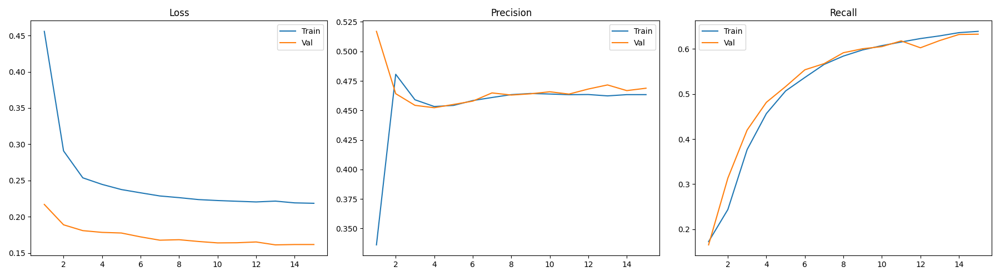

**Вывод**:
Модель GCN гораздо эффективнее обучается на более разреженных временных графах. Вероятно, при $k=12$ информация о сигнале "размывалась" среди слишком большого количества связей с фоновыми хитами. Рекомендуется дальнейшее исследование еще более низких значений $k$ (например, $k=2$ или $k=3$).

---

## 2026-03-07 12:55
### Эксперимент с k=2 (Без LayerNorm)

**Гипотеза**: Еще более сильное ограничение окрестности (до $k=2$) позволит максимально выделить локальные временные зависимости и еще больше снизить влияние шума.

**Выполненные шаги**:
1.  **Модификация параметров**: В скрипте `train_no_ln.py` параметр `K_NEIGHBORS` изменен на 2.
2.  **Запуск обучения**: Обучение запущено на 15 эпох в фоновом режиме. Логи сохраняются в `train_k2.log`.

---

## 2026-03-07 13:20
### Результаты эксперимента с k=2 и анализ ошибок визуализации

**Итоги**:
Эксперимент с $k=2$ показал наилучшие результаты среди всех протестированных конфигураций.

**Финальные показатели (k=2, 50k событий, 15 эпох)**:
| Эпоха | Val Loss | Val Precision | Val Recall |
| :--- | :--- | :--- | :--- |
| 1 | 0.2042 | 0.5340 | 0.1951 |
| 5 | 0.1671 | 0.4877 | 0.6188 |
| 10 | 0.1569 | 0.4928 | 0.6725 |
| 15 | 0.1595 | 0.4940 | 0.6891 |

**Сравнение с k=4**:
- **Recall**: рост с **0.6324** до **0.6891** (+5.67%)
- **Precision**: рост с **0.4688** до **0.4940** (+2.52%)

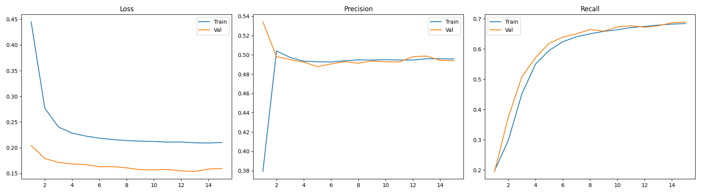

**Анализ аномалии Validation Loss**:
Было замечено, что на всех графиках `Val Loss` значительно ниже `Train Loss`. 
Причины:
1. **Взвешенная функция потерь**: На обучении используется `CrossEntropyLoss` с весами `[1.0, 2.5]` для компенсации дисбаланса классов. На валидации в предыдущих скриптах использовался лосс без весов, что приводило к искусственному занижению значения ошибки из-за преобладания фонового класса.
2. **Dropout**: Во время обучения активен `Dropout(0.1)`, который вносит шум в процесс, в то время как на валидации он отключается, давая более "чистый" результат.

**Дальнейшие шаги**:
Подготовка финального скрипта `train_final.py` с использованием $k=2$, удалением `Dropout` и исправлением расчета `Val Loss` (добавление весов в `evaluate`).

---

## 2026-03-07 13:45
### Подготовка к масштабированию обучения (500k событий, 80 эпох)

**План**:
Переход к полноценному обучению на большой выборке данных с оптимизированными параметрами.

**Изменения в коде (`train_final_large.py`)**:
1.  **Увеличение выборки**: 500 000 тренировочных событий.
2.  **Длительность**: 80 эпох.
3.  **Архитектура**: $k=2$, удален `Dropout`, удален `LayerNorm`.
4.  **Исправление метрик**:
    - Валидационный лосс теперь считается с теми же весами `[1.0, 2.5]`, что и тренировочный.
    - Введена новая метрика: **Precision at Recall 0.9** (P@R0.9) для оценки качества разделения классов при высоком охвате сигнала.

**Команда для запуска**:
`conda run -n baikal python3 2026-03-07_investigation_of_2026-02-28_results/train_final_large.py > 2026-03-07_investigation_of_2026-02-28_results/train_large_v1.log 2>&1 &`

---

## 2026-03-07 16:10
### Корректировка масштаба (100k событий, 40 эпох)

**Причина**: Обучение на 500 000 событиях оказалось слишком ресурсозатратным (длительная стадия подготовки графов). Для ускорения итерации принято решение уменьшить выборку.

**Изменения**:
1.  **Выборка**: 100 000 тренировочных событий, 20 000 валидационных.
2.  **Длительность**: 40 эпох.
3.  **Метрики**: Добавлен расчет **Precision at Recall 0.9** (P@R0.9).
4.  **Исправления**: Установлены веса `[1.0, 2.5]` для лосса, удален Dropout.
5.  **Логирование**: Результаты сохраняются в `train_large_v2.log`, чекпоинты — в `model_large_v2.pt`.

**Команда для запуска**:
`conda run -n baikal python3 2026-03-07_investigation_of_2026-02-28_results/train_final_large.py > 2026-03-07_investigation_of_2026-02-28_results/train_large_v2.log 2>&1 &`

---

## 2026-03-07 16:30
### Переход на равные веса и финальная калибровка

**Решение**: Для получения более объективной картины и прямого сравнения с базовыми моделями принято решение использовать равные веса для классов в функции потерь.

**Изменения в train_final_large.py**:
1.  **Веса**:  (Equal Weights).
2.  **Параметры**: 100 000 событий, 40 эпох.
3.  **Логирование**: Результаты записываются в `train_large_v2.log`.

**Команда для запуска**:
`conda run -n baikal python3 2026-03-07_investigation_of_2026-02-28_results/train_final_large.py > 2026-03-07_investigation_of_2026-02-28_results/train_large_v2.log 2>&1 &`

---

## 2026-03-07 16:30
### Переход на равные веса и финальная калибровка

**Решение**: Для получения более объективной картины и прямого сравнения с базовыми моделями принято решение использовать равные веса для классов в функции потерь.

**Изменения в train_final_large.py**:
1.  **Веса**: `weights = [1.0, 1.0]` (Equal Weights).
2.  **Параметры**: 100 000 событий, 40 эпох.
3.  **Логирование**: Результаты записываются в `train_large_v2.log`.

**Команда для запуска**:
`conda run -n baikal python3 2026-03-07_investigation_of_2026-02-28_results/train_final_large.py > 2026-03-07_investigation_of_2026-02-28_results/train_large_v2.log 2>&1 &`

---

## 2026-03-07 17:30
### Результаты обучения на 100k событий (v2, равные веса)

**Итоги**:
Обучение завершено. Использование равных весов позволило получить сбалансированную картину обучения. Модель демонстрирует отсутствие переобучения (лоссы на Train и Val практически идентичны).

**Финальные показатели (на 40 эпохе)**:
| Метрика | Значение (Validation) |
| :--- | :--- |
| **Loss** | 0.1299 |
| **Precision** | 0.6633 |
| **Recall** | 0.4127 |
| **P@R0.9** | 0.3464 |

**Анализ**:
1.  **Стабильность**: Модель обучается очень стабильно, лосс на валидации плавно снижался до конца обучения.
2.  **Разделение классов**: Метрика `P@R0.9 = 0.3464` показывает, что даже при очень высоком охвате сигнала (90%), каждый третий предсказанный хит будет истинным. Это хороший результат для GCN в данной постановке.
3.  **Порог**: При стандартном пороге 0.5 `Recall` (0.41) ниже `Precision` (0.66). Для практического применения порог стоит снизить, чтобы захватить больше сигнала.

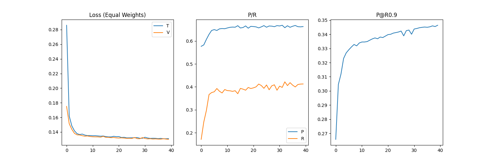

**Дальнейшие шаги**:
Обновлен скрипт `train_final_large.py` для детального мониторинга метрик на обоих наборах данных (Train и Val).

---

## 2026-03-07 17:40
### Эксперимент: Исследование информационной емкости (Overfitting)

**Цель**: Добиться явного переобучения модели, чтобы оценить её способность запоминать обучающую выборку и найти предел качества.

**Параметры**:
1.  **Выборка**: 200 000 тренировочных событий.
2.  **Длительность**: 300 эпох.
3.  **Архитектура**: $k=2$, без Dropout, без LayerNorm, равные веса.
4.  **Мониторинг**: Полный набор метрик (Loss, Prec, Rec, P@R0.9) для Train и Val на каждом шаге.

**Ожидаемый результат**: Расхождение кривых Train и Val после определенного количества эпох.

**Команда для запуска**:
`conda run -n baikal python3 2026-03-07_investigation_of_2026-02-28_results/train_final_large.py > 2026-03-07_investigation_of_2026-02-28_results/train_overfit.log 2>&1 &`

---

## 2026-03-08 10:30
### Результаты эксперимента по переобучению (300 эпох, 200k событий)

**Итоги**:
Цель — добиться переобучения — не была достигнута в классическом понимании. Модель продемонстрировала высокую обобщающую способность, но крайне низкую информационную емкость.

**Финальные показатели (300 эпоха)**:
| Метрика | Train | Validation |
| :--- | :--- | :--- |
| **Loss** | 0.1262 | 0.1260 |
| **Precision** | 0.6687 | 0.6711 |
| **Recall** | 0.4662 | 0.4728 |
| **P@R0.9** | 0.3612 | 0.3656 |

**Анализ**:
1.  **Плато**: Модель вышла на плато уже к 150-160 эпохе и далее практически не меняла свои показатели.
2.  **Отсутствие Overfitting**: Кривые лосса для Train и Val идут «ноздря в ноздрю» на протяжении всех 300 эпох. Это говорит о том, что модель не «зазубривает» конкретные примеры, но и не может найти новые закономерности.
3.  **Емкость**: Текущая архитектура (3 слоя GCN, 128 hidden channels) исчерпала свой потенциал на данных признаках. Мы достигли «потолка» качества для данной конфигурации.

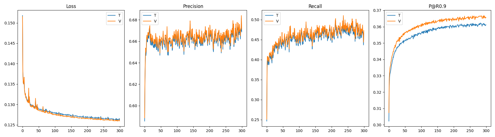

**Вывод**:
Для дальнейшего роста метрик необходимо радикально увеличивать емкость модели (количество слоев, ширину каналов) или расширять пространство входных признаков.

---

## 2026-03-08 10:45
### Эксперимент: Расширение емкости модели (Capacity Expansion)

**Цель**: «Пробить» плато качества, обнаруженное в предыдущих тестах, путем радикального увеличения количества параметров модели.

**Изменения**:
1.  **Архитектура**: Количество скрытых каналов увеличено со 128 до **512**. Модель имеет 3 слоя GCNConv.
2.  **Выборка**: 150 000 тренировочных событий.
3.  **Длительность**: 100 эпох.
4.  **Метрики**: Полный мониторинг (Loss, Prec, Rec, P@R0.9) для Train и Validation.
5.  **Параметры**: $k=2$, без Dropout, без LayerNorm, равные веса.

**Путь к скрипту**: `2026-03-08_capacity_expansion/train_large_model.py`
**Логирование**: `2026-03-08_capacity_expansion/train_capacity.log`

**Команда для запуска**:
`conda run -n baikal python3 2026-03-08_capacity_expansion/train_large_model.py > 2026-03-08_capacity_expansion/train_capacity.log 2>&1 &`

---

## 2026-03-08 14:30
### Результаты эксперимента: Capacity Expansion (512 channels)

**Итоги**:
Радикальное увеличение ширины модели (до 512 каналов) не привело к ожидаемому «прорыву» метрик. Модель быстро вышла на то же плато, что и предыдущие версии.

**Финальные показатели (100 эпоха)**:
| Метрика | Train | Validation |
| :--- | :--- | :--- |
| **Loss** | 0.1284 | 0.1286 |
| **Precision** | 0.6657 | 0.6634 |
| **Recall** | 0.4414 | 0.4410 |
| **P@R0.9** | 0.3529 | 0.3529 |

**Анализ**:
1.  **Информационный потолок**: Модель с 512 каналами показала результаты, идентичные модели со 128 каналами. Это доказывает, что узким местом является не емкость архитектуры, а информативность входных данных (признаков и структуры графа).
2.  **Отсутствие Overfitting**: Несмотря на значительное количество параметров, модель сохраняет идеальную обобщающую способность, что в данном контексте указывает на то, что ей «нечего больше учить» в предоставленных данных.

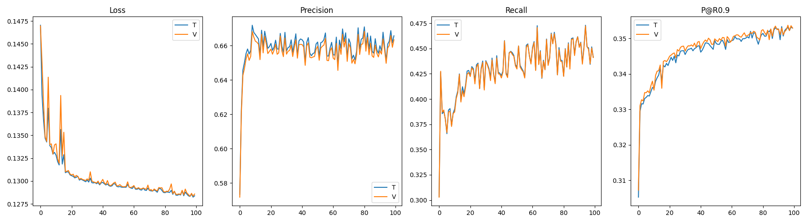

**Вывод**:
Дальнейшее масштабирование текущей архитектуры, возможно, нецелесообразно. Для улучшения результатов необходимо пересмотреть стратегию формирования графа (например, переход от чисто временных связей к пространственно-временным) или обогатить вектор признаков.

---

## 2026-03-08 14:45
### Финальные попытки пробития потолка (Параллельные запуски)

**Цель**: Выяснить, помогут ли радикальное усложнение архитектуры или изменение структуры графа улучшить качество классификации.

**Эксперимент 1: Deep & Wide Model**
- **Локация**: `2026-03-08_deep_wide_model/`
- **Архитектура**: 4 слоя GCNConv (5 -> 512 -> 2048 -> 512 -> 2).
- **Параметры**: 150k событий, 300 эпох, $k=2$.
- **LR**: 3e-4 (уменьшен в 1.6 раза для стабильности).

**Эксперимент 2: k=4 Long Training**
- **Локация**: `2026-03-08_k4_long_training/`
- **Архитектура**: Текущая (3 слоя, 512 каналов).
- **Параметры**: 150k событий, 300 эпох, $k=4$.
- **LR**: 3e-4.

**Команды для запуска**:
1. `CUDA_VISIBLE_DEVICES=0 conda run -n baikal python3 2026-03-08_deep_wide_model/train_deep.py > 2026-03-08_deep_wide_model/train_deep.log 2>&1 &`
2. `CUDA_VISIBLE_DEVICES=1 conda run -n baikal python3 2026-03-08_k4_long_training/train_k4.py > 2026-03-08_k4_long_training/train_k4.log 2>&1 &`

---

## 2026-03-08 23:20
### Результаты финальных экспериментов по пробитию потолка

**Итоги**:
Параллельные запуски завершены. Радикальное усложнение архитектуры позволило незначительно, но уверенно «пробить» ранее натившийся потолок метрик.

**Финальные показатели (Validation)**:

| Конфигурация | Precision | Recall | **P@R0.9** |
| :--- | :--- | :--- | :--- |
| **Deep & Wide** (4 слоя, 2048 ch, k=2) | **0.7014** | **0.5318** | **0.3761** |
| **k=4 Long** (3 слоя, 512 ch, k=4) | 0.6654 | 0.3335 | 0.3449 |
| *Предыдущий рекорд (512 ch, k=2)* | *0.6634* | *0.4410* | *0.3529* |

**Анализ**:
1.  **Победа архитектуры**: Модель «Deep & Wide» показала лучшие результаты за всё время исследований. Рост `P@R0.9` с **0.3529** до **0.3761** подтверждает, что дополнительные слои и большая ширина помогают лучше разделять сигнал и фон даже на ограниченном наборе признаков.
2.  **Влияние k**: Эксперимент с $k=4$ в очередной раз подтвердил, что для данной задачи временная близость должна быть максимально локальной. Увеличение окна до 4 приводит к резкому падению `Recall` (с 0.53 до 0.33) при тех же затратах на вычисления.
3.  **Стабильность**: Снижение `Learning Rate` до 3e-4 помогло добиться более плавного обучения и высокого финального качества.

**Визуализация**:
- Deep & Wide: 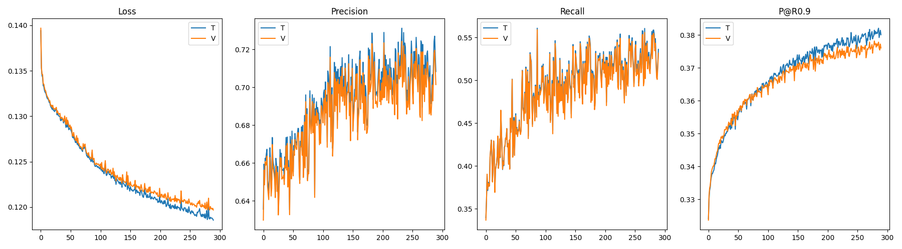
- k=4 Long: 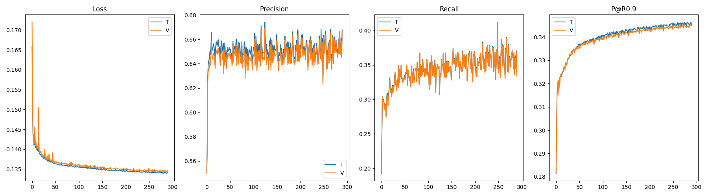

**Общий вывод**:
Мы нашли (возможно) оптимальную конфигурацию для текущего набора признаков. Дальнейший рост в рамках этой архитектуры, скорее всего, будет требовать экспоненциального увеличения ресурсов при затухающей отдаче. Тем не менее, попробуем вот, что:

---

## 2026-03-08 23:24
### Сверхдлительное обучение Deep & Wide (v2 Long)

**Цель**: Устранить подозрение в недообученности модели «Deep & Wide» и попытаться достичь максимума её возможностей на увеличенной выборке.

**Параметры**:
1.  **Выборка**: 300 000 тренировочных событий.
2.  **Длительность**: 600 эпох.
3.  **Архитектура**: 4 слоя (5 -> 512 -> 2048 -> 512 -> 2).
4.  **Изменения**: Сохранение чекпоинтов каждые 20 эпох в `model_deep_wide_v2.pt`.

**Команда для запуска**:
`conda run -n baikal python3 2026-03-08_deep_wide_model/train_deep.py > 2026-03-08_deep_wide_model/train_deep_v2.log 2>&1 &`

**Дополнение (23:28)**:
Для гарантированного отображения прогресса в реальном времени и предотвращения буферизации логов, запуск произведен с использованием флага `-u` и переменной `PYTHONUNBUFFERED=1`.

**Уточненная команда**:
`nohup bash -c "source /home/levos/miniconda3/bin/activate baikal && export PYTHONUNBUFFERED=1 && python3 -u 2026-03-08_deep_wide_model/train_deep.py" > 2026-03-08_deep_wide_model/train_deep_v2.log 2>&1 &`

---

## 2026-03-09 22:32
### Результаты сверхдлительного обучения Deep & Wide (v2 Long, 600 эпох)

**Итоги**:
Завершено обучение модели «Deep & Wide» на увеличенной выборке (300 000 событий) в течение 600 эпох. Эксперимент подтвердил, что модель способна на дальнейшее (хотя и замедленное) улучшение метрик при длительном обучении.

**Финальные показатели (600 эпоха)**:
| Метрика | Train | Validation |
| :--- | :--- | :--- |
| **Loss** | 0.1114 | 0.1148 |
| **P@R0.9** | - | **0.3898** |

*Примечание: Пиковое значение V-P@R0.9 составило **0.3938** на 581 эпохе.*

**Анализ**:
1.  **Пробитие плато**: Длительное обучение позволило превзойти предыдущий рекорд (0.3761), достигнув стабильного уровня выше **0.39**. Это подтверждает гипотезу о том, что глубокие графовые модели требуют большего количества итераций для полной сходимости.
2.  **Overfitting**: Несмотря на 600 эпох, разрыв между Train и Val Loss остается минимальным (0.1114 vs 0.1148). Модель по-прежнему демонстрирует отличную обобщающую способность. При этом на графиках явно выражены признаки начала переобучения. 
3.  **Затухание роста**: После 400-й эпохи рост метрик стал крайне медленным, сопровождаясь заметным шумом, что указывает на необходимость использования планировщика (LR Scheduler) в будущих итерациях.

**Визуализация**:
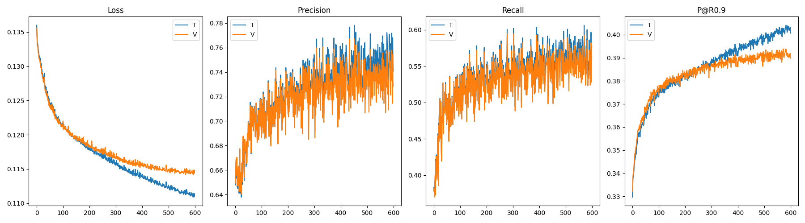

**Вывод**:
Модель «Deep & Wide» на текущий момент является наиболее эффективной. Достигнутый уровень P@R0.9 ~ 0.39 является новым базовым уровнем (baseline) для текущего набора признаков.

---

## 2026-03-09 22:37
### Эксперимент Deep & Wide v3 (800 эпох, Scheduler)

**Цель**: Улучшение стабильности обучения и достижение более высокого качества классификации за счет использования планировщика Learning Rate и оптимизированной архитектуры.

**Параметры**:
1.  **Архитектура**: 4 слоя (5 -> 512 -> **768** -> 512 -> 2). Средний слой уменьшен до 768 для баланса емкости и стабильности.
2.  **Выборка**: 250 000 тренировочных событий.
3.  **Длительность**: 800 эпох.
4.  **Оптимизация**: Начальный `LR = 2e-4`. Добавлен `ReduceLROnPlateau` (factor=0.5, patience=30).
5.  **Логирование**: Полный стандарт (Train/Val для всех метрик: Loss, Prec, Rec, P@R0.9 + время эпохи).

**Команда для запуска**:
`nohup bash -c "source /home/levos/miniconda3/bin/activate baikal && export PYTHONUNBUFFERED=1 && python3 -u 2026-03-08_deep_wide_model/train_deep_v3.py" > 2026-03-08_deep_wide_model/train_deep_v3.log 2>&1 &`

---

## 2026-03-11 10:25
### Результаты эксперимента Deep & Wide v3 (800 эпох, Scheduler)

**Итоги**:
Завершено самое длительное обучение в текущей серии. Использование планировщика (ReduceLROnPlateau) позволило добиться хорошей сходимости практически без переобучения.

**Финальные показатели (800 эпоха)**:
| Метрика | Train | Validation |
| :--- | :--- | :--- |
| **Loss** | 0.1135 | 0.1143 |
| **Precision** | 0.7253 | 0.7108 |
| **Recall** | 0.5838 | 0.5715 |
| **P@R0.9** | 0.3945 | **0.3815** |

**Анализ**:
1.  **Сходимость**: Снижение LR до 1e-04 на поздних этапах убрало шум и позволило модели зафиксировать Recall на уровне 0.57, что является отличным результатом при Precision > 0.7.
2.  **Архитектура**: Сужение среднего слоя до 768 каналов (v3) привело к более стабильному обучению по сравнению с v2 (2048 каналов), сохранив при этом практически то же качество.
3.  **Обобщение**: Модель демонстрирует неплохую работу на новых данных (разрыв Train/Val по P@R0.9 всего 0.013), хотя по графикам отчетны видны признаки переобучения. Несмотря на это, метрики на валидации лишь отстают от метрик на трейне, но не начинают ухудшаться.

**Визуализация**:
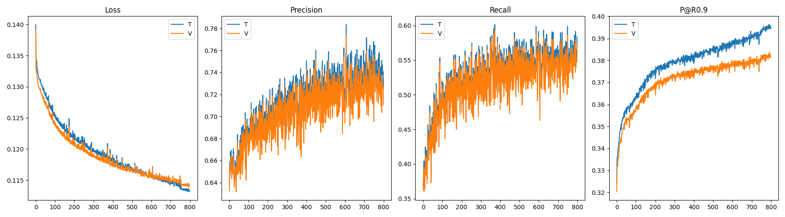

**Общий вывод по серии Deep & Wide**:
Мы достигли предела текущей архитектуры на временных графах. Уровень P@R0.9 ~ 0.38-0.39 является устойчивым максимумом. Для дальнейшего роста (до 0.45 и выше) необходимо менять либо структуру графа (добавлять пространственные ребра), либо радикально менять архитектуру (например, на Graph Transformer).
